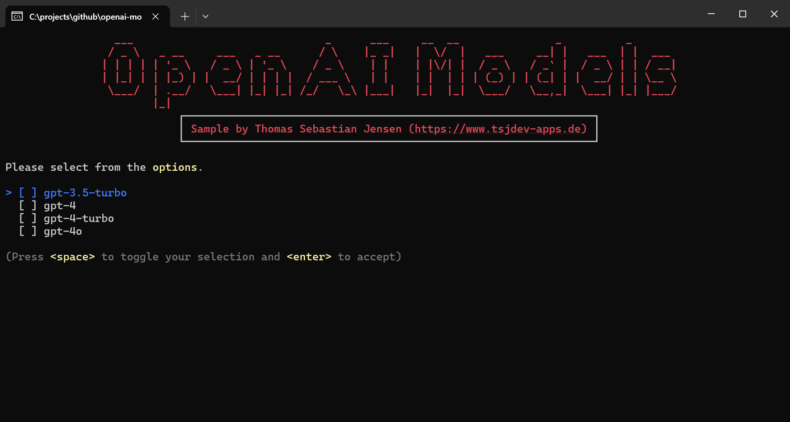
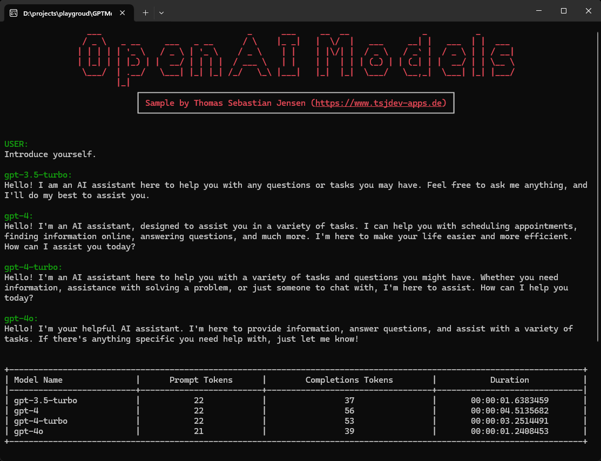
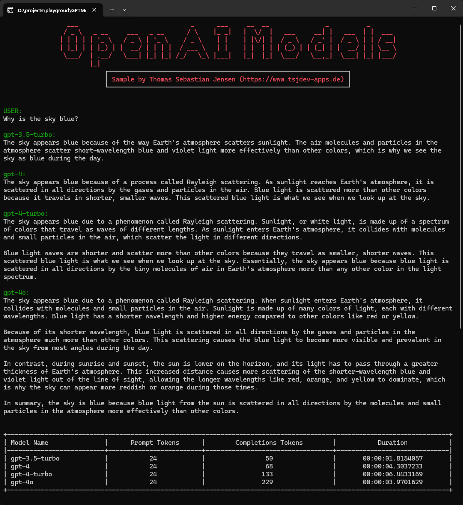
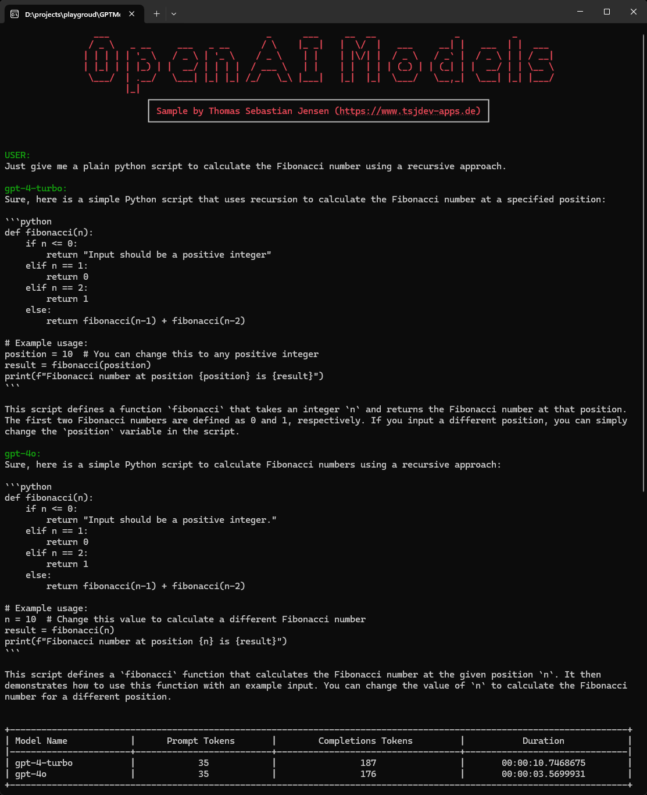

# Comparison of current OpenAI Models in C#

This repository contains a simple console application written in .NET 8 to compare all currently available [OpenAI](https://openai.com) Large Language Models.

## Usage

You need to create an OpenAI account on this [website](https://platform.openai.com/docs/overview). You have to pay to use the API so make sure that you add your payment information. After that, you can create an API Key [here](https://platform.openai.com/api-keys) for further use.

Just run the app and follow the steps displayed on the screen.

## Screenshots

Here you can see the console application in action:

First you need to insert the OpenAI key and you select the models you want to compare.

Now you are able to chat with all selected model. At the end you will get a table with the amount of used tokens and the duration.

Here are other samples.

## Blog Post

If you are more interested into details, please see the following posts on [medium.com](https://www.medium.com) or in my [personal blog](https://www.tsjdev-apps.de):

- [Let's compare the OpenAI models in C#](https://medium.com/medialesson/lets-compare-the-openai-models-in-c-916e33e1d539)
- [Einrichtung von OpenAI](https://www.tsjdev-apps.de/einrichtung-von-openai/)